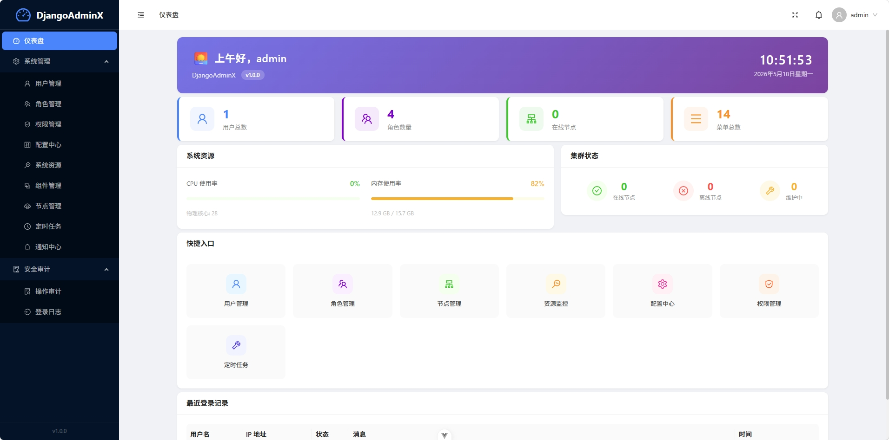

# DjangoAdminX

> 企业级 Django Admin 框架底座 — RBAC 权限、动态菜单、JWT 认证、配置中心（含业务选项列表）、定时任务、集群管理、系统监控、文件中心、加密工具、高可用部署。



## 特性

### 认证与安全
- **JWT 认证** — `simplejwt` Access/Refresh Token，黑名单机制
- **RBAC 权限** — 用户、角色、权限三级模型，基于 Django Permission 扩展
- **登录锁定** — 连续失败锁定账号，可配置阈值和时长
- **动态 IP 黑白名单** — 通过配置中心实时控制，无需重启
- **API 频率限制** — DRF Throttling 双层限流
- **操作审计** — 完整请求日志、登录日志、任务执行日志

### 核心功能
- **动态菜单** — `django-treebeard` 物化路径树形结构，多级 + 排序 + 角色绑定
- **配置中心** — KV 动态配置 + 业务选项列表一体化，支持 String/Int/Bool/JSON/加密/选项列表 六种类型，Fernet 加密存储，Redis 缓存加速，分组批量查询
- **定时任务** — APScheduler 独立进程运行（不受 Gunicorn 多进程影响），数据库驱动，Cron/间隔/一次性触发
- **文件中心** — 统一文件上传，支持 Local / MinIO 存储后端，可扩展
- **数据导入导出** — 基于 openpyxl 的 Excel 导入导出，支持多模型
- **图形验证码** — 登录验证码，基于 captcha 库
- **NTP 同步** — 对接 NTP 服务器，集群时间校准

### 运维监控
- **系统监控** — CPU/内存/磁盘/磁盘 IO/网络 IO/连接状态实时查看
- **集群管理** — 多节点注册、心跳检测、状态监控
- **实时日志** — WebSocket + SSE 双通道实时推送后台日志
- **健康检查** — `/api/common/health/` 含系统资源状态
- **保留策略** — 日志按天轮转，保留天数可配置

### 架构
- **统一 API 规范** — `{code, msg, data}` 全局响应格式，统一异常处理，统一分页
- **统一异常处理** — 全局 exception handler，所有异常统一包装为标准格式
- **业务/框架解耦** — 框架代码 `djangoadminx/`，业务代码独立容器部署，JWT Token Introspection 认证
- **分布式部署** — Nginx 负载均衡 + Redis Session 共享 + PostgreSQL HA
- **配置环境分离** — `base.py` / `dev.py` / `prod.py` 三环境
- **API 文档** — `drf-spectacular` → OpenAPI 3.0 + Swagger UI
- **软删除** — `django-safedelete`，所有核心模型可恢复

## 技术栈

| 层 | 技术 |
| --- | --- |
| 后端 | **Django 5.2 LTS** + **DRF 3.14** |
| 数据库 | PostgreSQL 16 / SQLite (dev) |
| 缓存 | Redis 7（可选，无 Redis 时自动降级 LocMemCache） |
| 认证 | SimpleJWT + Django Permission 扩展 |
| 树形结构 | django-treebeard（物化路径） |
| 加密 | Cryptography Fernet（配置加密字段）+ GMSSL（SM4） |
| 调度 | APScheduler 3.x（独立进程） |

## 快速开始

```bash
# 克隆
git clone https://github.com/Bronya0/DjangoAdminX.git
cd DjangoAdminX

# 虚拟环境（Python 3.12+）
python -m venv .venv
# Windows:
.venv\Scripts\activate
# Linux/Mac:
source .venv/bin/activate

# 安装依赖
pip install -r requirements.txt

# 复制环境变量
cp .env.example .env

# 初始化数据库
python manage.py migrate

# 初始化基础数据（角色、菜单、配置）
python manage.py init_data

# 创建超级用户
python manage.py init_data --superuser --username admin --password admin123

# 启动（开发模式）
python manage.py runserver

# 访问 API 文档
open http://127.0.0.1:8000/api/docs/
```

## 启用 Redis（可选，推荐）

系统 **无需任何代码改动**，只需设置环境变量，启动时自动检测并切换。

### 配置

```bash
# .env 中设置 Redis 地址（默认值就是这句，已存在则跳过）
REDIS_URL=redis://127.0.0.1:6379/0

# 有密码时：
REDIS_URL=redis://:your-password@127.0.0.1:6379/0
```

### 启动 Redis

```bash
# Docker 一键启动所有服务（含 Redis）
docker compose up -d

# 或本地直接安装
# Ubuntu/Debian: sudo apt-get install redis-server && sudo systemctl start redis-server
# Windows: 下载 https://redis.io/downloads/ 运行 redis-server.exe
# Mac: brew install redis && brew services start redis
```

### 验证接入成功

启动项目后，访问 `GET /api/common/cache-stats/`：

- ✅ 有 Redis：`{"backend": "redis", "msg": "...Redis 信息..."}`
- ❌ 无 Redis：`{"backend": "locmem", "msg": "本地内存缓存，不支持统计"}`

### 有 Redis 后多了什么？

| 能力 | 无 Redis | 有 Redis |
|------|----------|----------|
| 缓存 | 进程内 LocMemCache，各 worker 独立 | RedisCache，全局共享 |
| WebSocket 实时日志 | 单 worker 可用 | 跨 worker / 跨节点广播 |
| 定时任务状态持久化 | MemoryJobStore（重启后从 DB 重载） | RedisJobStore，调度状态完整保留 |
| 分布式锁 | 退化到 threading.Lock（仅进程内） | 真正的 Redis 分布式锁 |
| 限流器 | allow-all（不限制） | Redis 滑动窗口限流 |
| ORM 查询缓存 (cacheops) | 自动禁用 | 自动启用 |
| 配置中心缓存 | 各 worker 独立缓存（可能读到旧值） | 全局统一缓存 + 实时失效 |

> 一句话：不配 Redis 也能跑，配上更好。

## 项目结构

```
DjangoAdminX/
├── djangoadminx/                  # 框架代码
│   ├── accounts/                  #   用户、角色、权限、JWT 登录/登出、登录锁定
│   ├── menu/                      #   动态菜单（treebeard 物化路径）
│   ├── config_center/             #   配置中心（KV + 选项列表 + 加密 + 缓存）
│   ├── monitor/                   #   系统资源监控（psutil）
│   ├── cluster/                   #   集群节点管理
│   ├── webservice/                #   WebService + 定时任务 + 任务日志
│   ├── file_center/               #   文件上传/记录管理
│   ├── data_center/               #   数据导入导出（Excel）
│   ├── captcha/                   #   图形验证码
│   ├── audit/                     #   操作审计日志
│   ├── policy/                    #   密码策略
│   └── common/                    #   中间件、统一响应/异常/分页、实时日志、调度器
├── config/
│   ├── settings/
│   │   ├── base.py                #   基础配置
│   │   ├── dev.py                 #   开发环境（SQLite + DEBUG）
│   │   └── prod.py                #   生产环境（PostgreSQL + 安全加固）
│   ├── urls.py                    #   路由入口
│   ├── wsgi.py                    #   WSGI（Gunicorn）
│   └── asgi.py                    #   ASGI（Channels WebSocket）
├── deploy/
│   ├── docker/
│   │   ├── Dockerfile
│   │   ├── entrypoint.sh
│   │   ├── supervisor.conf
│   │   └── docker-compose.yml
│   ├── systemd/
│   │   ├── djangoadminx-web.service      # Gunicorn
│   │   ├── djangoadminx-scheduler.service # APScheduler
│   │   └── biz-template.service           # 三方业务模板
│   └── nginx/
│       └── nginx.conf
├── start-linux.sh
├── start-win.bat
├── requirements.txt
└── manage.py
```

## API 概览

| 模块 | 端点 | 说明 |
|------|------|------|
| **Auth** | `POST /api/accounts/login/` | JWT 登录（含登录锁定 + 验证码检查） |
| | `POST /api/accounts/logout/` | 登出（黑名单 refresh token） |
| | `GET /api/accounts/users/me/` | 当前用户信息 + 权限列表 + 动态菜单 |
| **用户** | `GET/POST/PUT/DELETE /api/accounts/users/` | 用户 CRUD |
| | `GET /api/accounts/users/{id}/` | 用户详情 |
| **角色** | `GET/POST/PUT/DELETE /api/accounts/roles/` | 角色 CRUD（绑定权限 + 菜单） |
| **权限** | `GET /api/accounts/permissions/` | 权限列表（含 content_type 分组） |
| **登录日志** | `GET /api/accounts/login-logs/` | 登录历史审计 |
| **密码** | `POST /api/policy/change-password/` | 修改密码 |
| **菜单** | `GET/POST/PUT/DELETE /api/menu/` | 菜单 CRUD |
| | `GET /api/menu/tree/` | 当前用户菜单树（按角色过滤） |
| | `POST /api/menu/move/` | 树形节点拖拽排序 |
| **配置中心** | `GET/POST/PUT/DELETE /api/config/` | 动态配置 CRUD（加密字段脱敏展示） |
| | `GET /api/config/by_group/?group=xxx` | 按分组批量查询（业务选项列表） |
| **系统监控** | `GET /api/monitor/resources/` | CPU / 内存 / 磁盘 / 网络 IO 实时数据 |
| | `GET /api/monitor/netstat/` | 网络连接状态统计 |
| **集群** | `GET/POST/PUT/DELETE /api/cluster/nodes/` | 集群节点管理 |
| | `GET /api/cluster/nodes/overview/` | 集群概览（在线/离线统计） |
| **WebService** | `GET/POST/PUT/DELETE /api/webservice/configs/` | WSDL 配置管理（密码字段写后脱敏） |
| | `POST /api/webservice/configs/{id}/invoke/` | 调用外部 WebService |
| **定时任务** | `GET/POST/PUT/DELETE /api/webservice/jobs/` | 定时任务 CRUD |
| | `POST /api/webservice/jobs/{id}/run_once/` | 立即执行一次 |
| | `GET /api/webservice/jobs/status/` | 调度器运行状态 |
| | `POST /api/webservice/jobs/reload/` | 全量重载任务 |
| **任务日志** | `GET /api/webservice/job-logs/` | 任务执行历史 |
| **WS 调用日志** | `GET /api/webservice/ws-logs/` | WebService 调用历史 |
| **文件中心** | `POST /api/file/upload/` | 文件上传（Local / MinIO） |
| | `GET /api/file/records/` | 文件记录列表 |
| **数据导入导出** | `GET /api/data-center/export/?model=xxx` | Excel 导出 |
| | `POST /api/data-center/import/` | Excel 导入 |
| **验证码** | `GET /api/captcha/` | 获取图形验证码 |
| **审计日志** | `GET /api/audit/logs/` | 操作审计日志 |
| **缓存** | `GET /api/common/cache-stats/` | 缓存统计 |
| **公共** | `GET /api/common/health/` | 健康检查（含系统资源） |
| | `GET /api/common/log/tail/` | SSE 实时日志流 |
| **文档** | `GET /api/schema/` | OpenAPI 3.0 Schema |
| | `GET /api/docs/` | Swagger UI |

## 配置中心

统一配置模型，同时支持系统参数和业务选项列表，共用一套 API 和缓存机制。

### 支持的 value_type

| 类型 | 说明 | 用法 |
|------|------|------|
| `string` | 字符串 | `Config.get_value("KEY", default="")` |
| `int` | 整数 | 自动转换 int |
| `bool` | 布尔 | `"true"` / `"1"` / `"yes"` 为 True |
| `json` | JSON | 自动解析为 dict/list |
| `encrypted` | 加密 | Fernet 加密落库，读取自动解密 |
| `options` | 选项列表 | JSON value 格式 `[{"label":"草稿","value":"draft"},...]` |

### 读取方式

```python
# 系统参数（classmethod，带缓存）
max_attempts = Config.get_value("LOGIN_MAX_ATTEMPTS", default=3)

# 业务选项列表（按分组批量查询，带分组缓存）
options = Config.get_by_group("post_status")
# → {"post_status_options": [{"label": "草稿", "value": "draft"}, ...]}

# REST API 批量查询
# GET /api/config/by_group/?group=post_status
```

### 缓存机制

- 单 key 缓存 `config:{key}`，TTL 1 小时
- 分组缓存 `config_group:{group}`，TTL 1 小时
- config 变更（save/delete）时自动清除对应的 key 缓存和分组缓存

### 常用内置配置

| Key | 说明 | 默认值 |
|-----|------|--------|
| `IP_WHITELIST` | IP 白名单（逗号分隔） | 空（不限制） |
| `IP_BLACKLIST` | IP 黑名单（逗号分隔） | 空 |
| `LOGIN_MAX_ATTEMPTS` | 登录最大失败次数 | 5 |
| `LOGIN_LOCK_DURATION` | 锁定时长（分钟） | 15 |

## 工具库

### crypto_utils — 加解密工具

```python
from djangoadminx.common.crypto_utils import (
    sm4_ecb_encrypt, sm4_cbc_encrypt,
    aes_cbc_encrypt, aes_gcm_encrypt,
    md5_hash, sha256_hash, hmac_sha256,
)

# SM4 加密（国密）
cipher = sm4_ecb_encrypt(b"plaintext", key)
plain = sm4_ecb_decrypt(cipher, key)

# AES-GCM（推荐，自带认证）
cipher, tag, nonce = aes_gcm_encrypt(b"plaintext", key)

# 哈希
digest = sha256_hash(b"data")
```

所有函数提供 bytes 和 base64 两种变体（`_b64` 后缀）。

## Scheduler 独立进程

APScheduler 以独立进程运行，不受 Gunicorn 多 worker 影响：

```bash
# 开发环境
python manage.py run_scheduler

# 生产（systemd）
sudo systemctl start djangoadminx-scheduler
```

- Job 定义存储在数据库（`ScheduleJob` 模型），CRUD 后通过 Django 信号自动通知调度器重载
- Job 存储使用 Redis JobStore，进程重启自动恢复
- 支持 `cron` / `interval` / `date` 三种触发类型
- 内置 `ntp_sync()`、`sample_task()` 任务模板

## 开发指南

### 业务容器开发

业务功能运行在独立容器中，通过 JWT Token Introspection 接入平台认证：

1. 使用任意语言/框架编写业务服务
2. 请求到达后，将前端 `Authorization` 头中的 token 发送至 `POST /api/v1/accounts/introspect/`
3. 平台返回 `user_id`、`roles`、`permissions`，业务容器据此执行本地鉴权
4. 菜单/路由通过注册 API 或配置中心手动配置

### 新增定时任务

1. 在 `djangoadminx/webservice/tasks.py` 或业务模块中编写处理函数
2. 在管理端添加 `ScheduleJob` 记录，指定 `handler` 为 `module.path.func_name`
3. APScheduler 自动加载

### 测试

```bash
# 运行全部测试
python manage.py test

# 运行单个模块
python manage.py test djangoadminx.accounts
```

## 部署架构

```
                        ┌─────────────┐
                        │  Nginx LB   │  ← 限流 / SSL / 反向代理
                        └──────┬──────┘
                    ┌──────────┼──────────┐
                    ▼          ▼          ▼
              ┌─────────┐ ┌─────────┐ ┌─────────┐
              │Gunicorn │ │Gunicorn │ │Gunicorn │  ← 水平扩展
              │ 节点 1   │ │ 节点 2   │ │ 节点 N   │
              └────┬────┘ └────┬────┘ └────┬────┘
                   │           │           │
              ┌────┴───────────┴───────────┴────┐
              │         Redis (Cluster)         │  ← Session / Cache / Queue
              └────────────────────────────────┘
                   │           │           │
              ┌────┴───────────┴───────────┴────┐
              │   PostgreSQL Patroni HA (3节点)   │  ← 主从 + 自动故障转移
              └────────────────────────────────┘

         ┌────────────────────────────────────────┐
         │  APScheduler (独立进程)                 │
         │  python manage.py run_scheduler        │  ← 不受 Gunicorn 多进程影响
         └────────────────────────────────────────┘
```

## 部署（Linux + systemd）

提供 systemd service unit 文件，支持开机自启、崩溃自动拉起。

### 服务说明

| 组件 | Service | 说明 |
|------|---------|------|
| Web | `djangoadminx-web.service` | Gunicorn，Type=notify，HUP 热重载 |
| 调度器 | `djangoadminx-scheduler.service` | APScheduler，After=web |
| 三方业务 | `biz-{name}.service` | 按模板创建，After=web |

### 安装

```bash
# 1. 修改路径
sed -i 's|/path/to/DjangoAdminX|/var/www/djangoadminx|g' deploy/systemd/*.service

# 2. 复制到系统目录
sudo cp deploy/systemd/djangoadminx-*.service /etc/systemd/system/

# 3. 重新加载
sudo systemctl daemon-reload

# 4. 启用开机自启 + 启动
sudo systemctl enable --now djangoadminx-web
sudo systemctl enable --now djangoadminx-scheduler
```

### 常用操作

```bash
# 查看状态
sudo systemctl status djangoadminx-web

# 重启
sudo systemctl restart djangoadminx-web

# 优雅重载（worker 逐个重启，不停服）
sudo systemctl reload djangoadminx-web

# 查看实时日志
sudo journalctl -u djangoadminx-web -f

# 停止
sudo systemctl stop djangoadminx-web
```

### 三方业务

```bash
# 复制模板
sudo cp deploy/systemd/biz-template.service /etc/systemd/system/biz-blog.service

# 编辑，替换 {APP_NAME} 和路径
sudo vi /etc/systemd/system/biz-blog.service

# 启动
sudo systemctl enable --now biz-blog
```

## License

MIT